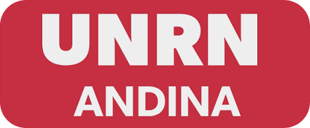

# Programación 1 - 2026 👾

## Grupo":"

```python
while True:
    dopamina.borrar()
```

>[!Note]
>**"Un bucle infinito en Python que busca vaciar tu cerebro del veneno del scroll infinito"**<br>

## Autores

- [@julietaguzman](https://github.com/julietaguzman)
- [@chazargl](https://github.com/chazargl)

```python
    Alumnos: Julieta Guzmán / Juan Matias Chazarreta
    Ingeniería en Telecomunicaciones
    Universidad Nacional de Río Negro (UNRN)
```

<p align="center">
  
</p>

## Lenguajes


## Sobre este repositorio

Acá se va a publica todo lo relacionado al progreso del trabajo práctico integrador N° 1

- Documentación de estructura JSON de salida.
- Implementación inicial del parseo del TXT recibido por argumento de línea de comandos.
- implementación inicial del módulo de validaciones.
